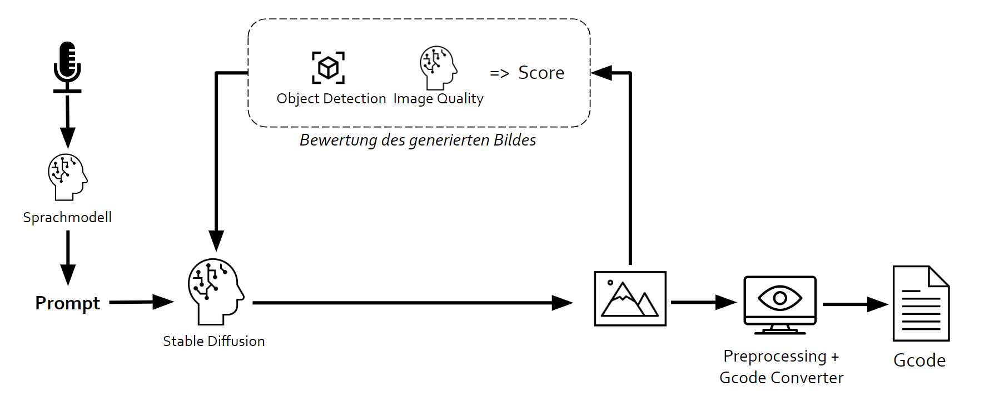
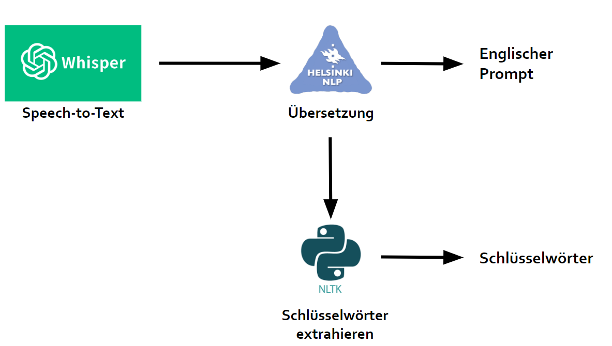
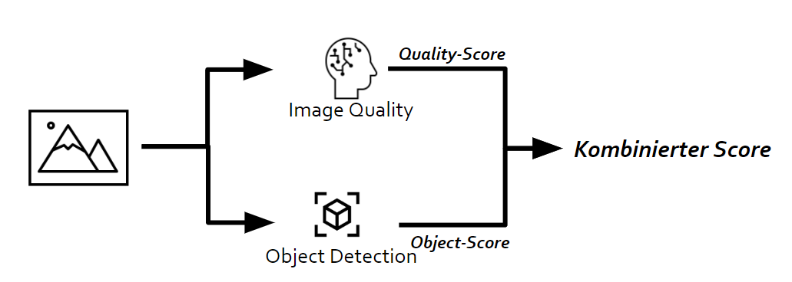

# Speech-To-GCode

This project was developed during our master studies at the [Kempten University of Applied Sciences](https://www.hs-kempten.de/en/) in cooperation with the [Institute for Data-optimised Manufacturing (IDF)](https://www.hs-kempten.de/en/research/research-institutes/institute-for-data-optimized-manufacturing-idf).

**Project members**: Linus Göhl, Quirin Sandt, Benjamin Schober

## Introduction

The goal of the project was to create a pipeline that converts language to GCode (e.g. for a CNC milling machine). For this the different components are necessary:

Short information on how this pipeline works:

- Audio is transcribed to text returning the prompt
- Prompt is used to generate images using Stable Diffusion
- Image is rated by its quality and using object detection
- Selected image is preprocessed and converted to GCode

Below is more detailed information about the specific pipeline parts, models and technologies used.

## Pipelines

Most of the pipeline components are deployed within a Docker container running on a GPU cluster. The pipelines are accessed through a REST API.

### Text processing

Models and technologies used:

| Model/Technology | Description | Link |
| --- | --- | --- |
| ``openai/whisper-large-v2`` | Speech recognition model (ASR) | [OpenAI GitHub](https://github.com/openai/whisper), [HuggingFace Model](https://huggingface.co/openai/whisper-large-v2), [[`Paper`](https://arxiv.org/abs/2212.04356)] |
| ``Helsinki-NLP/opus-mt-de-en`` | Translation model | [Helsinki-NLP GitHub](https://github.com/Helsinki-NLP/OPUS-MT-train/blob/master/models/de-en/README.md), [HuggingFace Model](https://huggingface.co/Helsinki-NLP/opus-mt-de-en) |
| ``NLTK`` | Natural Language Toolkit. Used for keyword/noun extraction | [NLTK GitHub](https://github.com/nltk/nltk), [NLTK Website](https://www.nltk.org/) |

Since the pipeline is accessed through a REST API, all the functional parts are implemented in the class [TextPipeline](./server/api/pipelines/text/TextPipeline.py). When the pipeline is deployed, one instance of the class is created and the models are loaded into VRAM. Since the pipeline consists of multiple models and parts, the following endpoints and functions are available:

| Endpoint |  Description |
| --- | --- |
| ``/api/transcribe`` | Transcribes the audio file to text (executes the ``transcribe``, ``translate`` and ``extraact_nouns`` function). |
| ``/api/translate`` | Translates the text to English (executes the ``translate`` and ``extract_nouns`` function) |

### Image creation and rating

| Model/Technology | Description | Link |
| --- | --- | --- |
| ``stabilityai/stable-diffusion-2-1-base`` | Image generation model | [HuggingFace Model](https://huggingface.co/stabilityai/stable-diffusion-2-1-base), [[`Paper`](https://arxiv.org/abs/2112.10752)] |
| ``LAION-Aesthetics_Predictor V1`` | Image rating model | [GitHub](https://github.com/LAION-AI/aesthetic-predictor), [[`Paper`](https://arxiv.org/abs/2303.05499)] |
| ``Grounding DINO`` | Object detection model | [GitHub](https://github.com/IDEA-Research/GroundingDINO)

### Image preprocessing and GCode generation

Note: This pipeline component is not deployed within a Docker container, it is running on the local machine.

## Code Documentation

Most parts of the code is documented through comments. Here are some key concepts of the project:

- [``server``](./server): Contains the REST API and the pipeline components
- [``local``](./local): Contains the local pipeline components (image preprocessing and GCode generation) and the UI

The image pipeline is seperated into different files. Besides the main file [``image_pipeline.py``](./local/image_pipeline.py), there are other files. This is because the main class would be to big and hard to read. Also, the ObjectDetection pipeline is seperated into a different file, which works like a wraper around the GroundingDINO model.

Another thing to mention, is that all code within the [``milling_grbl``](./local/components/image_to_gcode/milling_grbl/) folder was provided by the [IDF](https://www.hs-kempten.de/en/research/research-institutes/institute-for-data-optimized-manufacturing-idf).

## Getting Started

To get started using this project, check the [``getting-started.md``](./getting-started.md) file.
